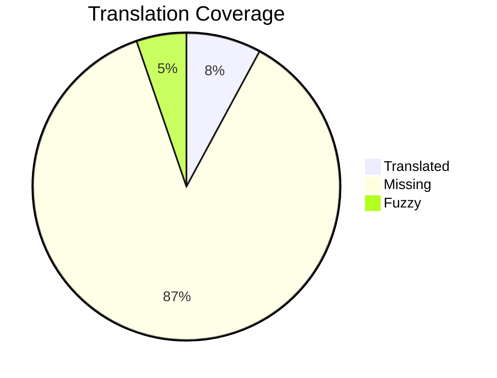

# 📊 Translation Report

> [!WARNING]
> Translation coverage is low: **8.3%**

📈 Detailed Statistics

| Metric | Count | Percentage |
|:-------|------:|-----------:|
| Total | 432 | 100% |
| Translated | 36 | 2.8% |
| Fuzzy | 24 | 5.6% |
| Missing | 396 | 91.7% |

🔄 Translation Flow

## 📝 Translation Tasks

- [ ] **docdiff-docs** (1 items)
- [ ] **unnamed** (209 items)
- [ ] **docdiff-code-quick-start** (1 items)
- [ ] **docdiff-documentation-contents** (1 items)
- [ ] **docdiff-license** (1 items)
- [ ] **developer-guide** (1 items)
- [ ] **dev-environment-setup** (1 items)
- [ ] **dev-prerequisites** (1 items)
- [ ] **dev-initial-setup** (1 items)
- [ ] **dev-code-clone-repository** (1 items)